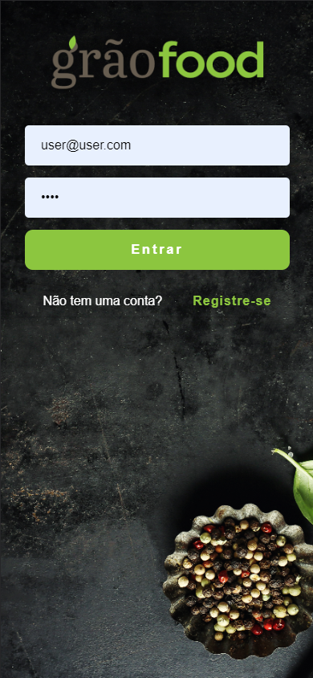
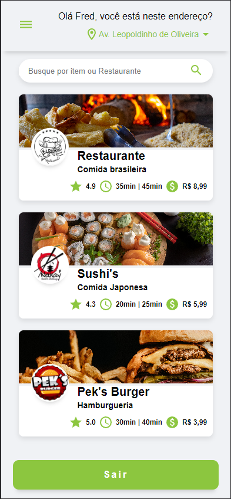

💻 Sobre o projeto

🔔 Projeto de buscas por restaurantes

## Descrição

O Grão Food é uma plataforma de restaurantes de variados produtos.

<br>
<hr>
<p align="center">
	
  
  
  
</p>
<hr>
<br>

### Ferramentas

- [React](https://legacy.reactjs.org/docs/getting-started.html)

- [Route](https://www.npmjs.com/package/react-router-dom)

- [Git](https://git-scm.com/doc)

### Montagem do ambiente de desenvolvimento

O primeiro passo é clonar o projeto utilizando o método HTTPS ou SSH.

SSH

```sh
git clone git@github.com:eosantos/grao-food.git
```

HTTPS

```sh
git clone https://github.com/eosantos/grao-food.git
```

### Instalar dependências do projeto

Com o comando abaixo instalamos todos os pacotes definidos no package.json para configuração do servidor local:

```sh
npm i
```

### Acessando a aplicação

Para iniciar o projeto basta executar o comando abaixo:

```sh
npm start
```
Após a execução do comando acima basta abrir o link `http://localhost:3000`.